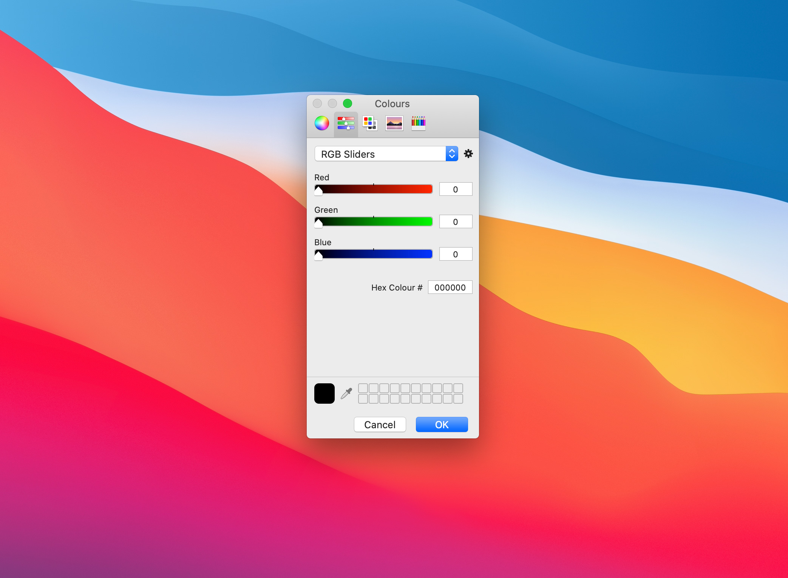

# ColourPicker 🎨
macOS ColourPicker.

## Features ⭐

⭐ macOS UI\
⭐ Simple script\
⭐ Fully Responsive\
⭐ Lots of fun

## Getting Started 🚀

1. Open Script Editor and create a new document
2. Open colour_picker.scpt
3. Save as an Application in your Applications folder
4. Launch your new ColourPicker application.

## License 📄

This project is licensed under the MIT License - see the [LICENSE.md](LICENSE.md) file for details

## Acknowledgments 🎁

It's only shown while editing in specific applications though, so here's how you can turn it simple script into a dedicated app.
